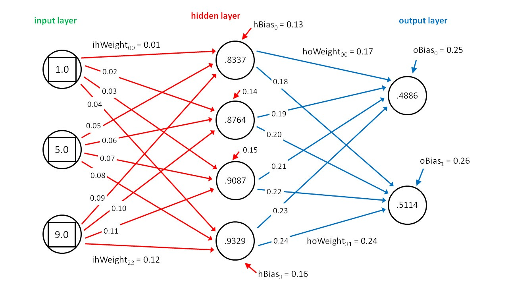

# Overview
This series is designed to teach you how to create basic neural networks with python and tensorflow 2.0. It will cover everything from basic neural networks trained on MNIST data to convolutional neural networks.

# What You’ll Learn
This series is packed full of valuable information.
You will learn and understand the following after this tutorial:

* How a Neural Network Works
* How to Design a Neural Network
* How to Train a Neural Network
* How to use a Neural Network to make predicitions
* The different kinds of Neural Networks

# Pre-requisites
This is NOT a beginner tutorial and I will not be teaching python syntax. It is also highly encouraged that you are familiar with Object Orientated Principles

* Intermediate Programming Knowledge
* Experience With Python 3 Syntax

# What is a Neural Network?
So what is a neural network? When most people hear of a neural network
the think of some magical black box that is capable of solving very complicated problems. 

In reality a neural network is just a very fancy math formula, well kind of. 
A neural network is biologically inspired and named after the network of neurons that exist
in your brain. A neural network is simply a group of connected neurons,
there are some input neurons, some output neurons and a group of what we call hidden 
neurons in between. When we feed information to the input neurons we get some information
from the output neurons. Information starts at the input neurons and travels to the next
layers of neurons having whats called a weight and a bias applied to it.

These weight and biases start out randomly determined and are tweaked as the network learns
and sees more data. After reaching a new layer there is a function applied to each neurons
value that is called an activation function.

    

